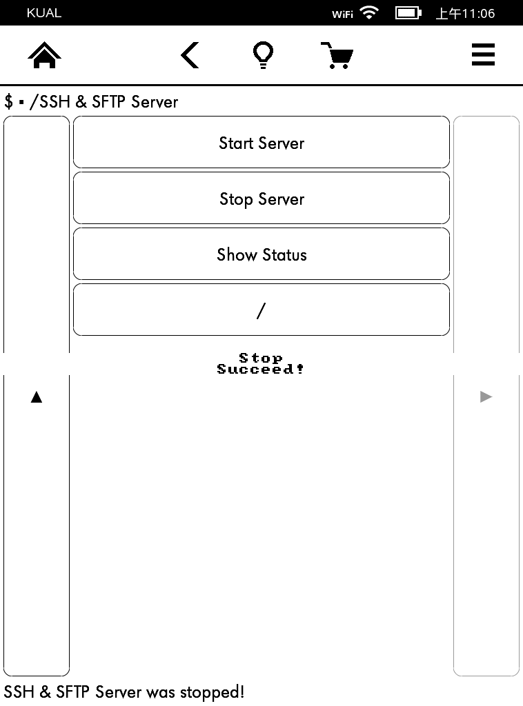

# kual-ssh-sftp-server

依赖于 KUAL 和 KOReader 的 Kindle 插件，用于在 KUAL 里直接启动 SSH & SFTP Server。

## 安装方法

该插件依赖于 KUAL 和 KOReader，请确保之前已经正确安装它们。

本插件安装方法：

1. 下载本项目代码；

2. 将 Kindle 用数据线连接电脑，把上面下载的代码里的 ssh-sftp-server 文件夹拷贝到 Kindle 的 /mnt/us/extensions 目录下。

## 使用方法

打开 KUAL，就可以在插件列表里看到「SSH & SFTP Server」菜单项了：

点击后可进入插件功能列表：

点击「Start Server」可以启动 SSH & SFTP Server：

启动成功后，就可以使用称手的 SSH / SFTP 工具无线连接 Kindle 进行管理了。

点击「Stop Server」可以停止 SSH & SFTP Server：

点击「Show Status」可以查看当前状态，是启动还是停止。

## 适用机型

- Kindle PaperWhite

## License

[MIT License](./LICENSE)
